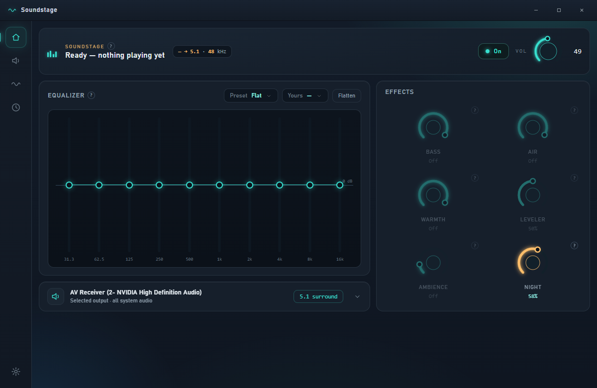
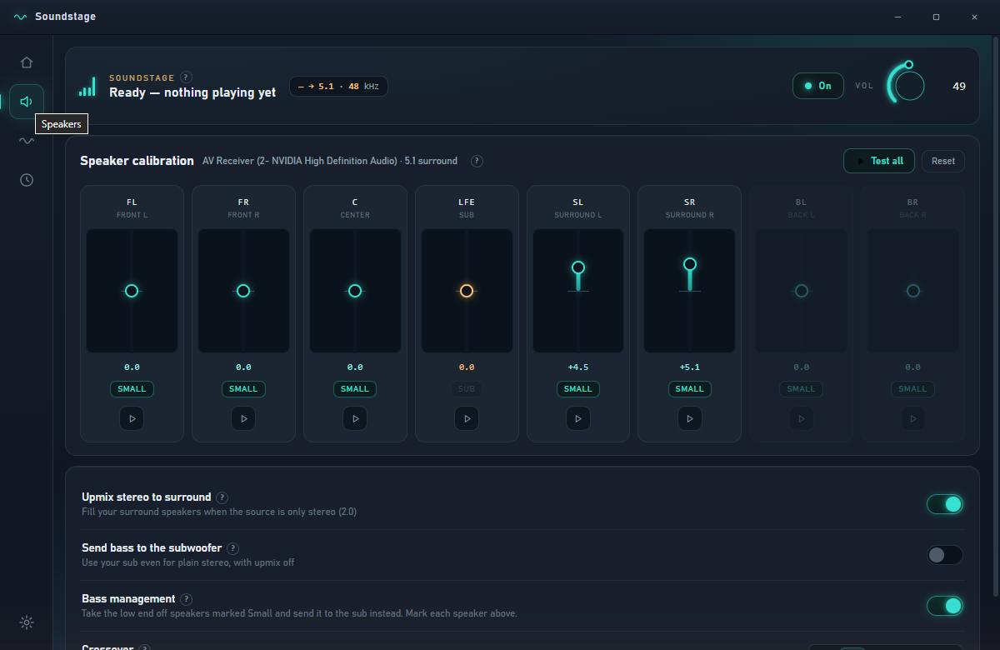

<p align="center">
  
</p>

<h1 align="center">Soundstage</h1>

<p align="center">
  <b>System-wide surround sound control for Windows.</b><br/>
  A ten-band EQ, real effects, and per-speaker calibration for your 5.1 / 7.1 setup —
  applied to <i>everything</i> the PC plays, with no virtual cables and no third-party drivers.
</p>

<p align="center">
  
  
  
</p>

<p align="center">
  
</p>

---

Most PC EQ tools only touch stereo, or make you install a virtual audio cable and reroute
your whole system through it. Soundstage doesn't. It ships its own **audio engine plugin**
that Windows loads directly into its audio pipeline, so your EQ, effects and per-speaker
tuning apply to every app — Spotify, browsers, games, movies — across a real **5.1 or 7.1**
layout. Nothing sits in front of your sound. No cable, no Equalizer APO, no Voicemeeter.

## Screenshots

| Equalizer &amp; effects | Per-speaker calibration |
| :---: | :---: |
|  |  |

## Features

**Equalizer**
- Ten-band graphic EQ with a live frequency-response curve
- Preset dropdown with instant apply — plus your own saved presets
- Curated starting points (Flat, Music, Film &amp; Dialogue, and more)

**Effects** — each is one toggle and one intensity dial
- **Bass** — weight and drive on the low end
- **Warmth / Air** — low-shelf and high-shelf tone shaping
- **Leveler** — a gentle compressor that evens out loud and quiet passages
- **Ambience** — a tuneable reverb for space and depth
- **Night mode** — cuts the deep bass that travels through walls and tames sudden peaks, so late-night listening stays audible without waking the house

**Surround &amp; per-speaker calibration**
- Individual level trim for every speaker — FL, FR, C, LFE, SL, SR, BL, BR — with a per-channel test tone
- **Upmix** stereo sources to fill your surround speakers
- **Bass management**: mark speakers "Small" and route their low end to the subwoofer, with an adjustable crossover
- Detects your real hardware layout (2.0 / 5.1 / 7.1) and labels channels accordingly

**Everyday**
- Live level meters on every speaker, and "now playing" pulled from Windows' media session
- Instant A/B bypass so you can hear exactly what Soundstage is doing
- Runs in the system tray, optional launch-on-boot, volume-key control
- One self-contained installer — no runtime prerequisites

## Install

1. Download **`Soundstage-1.0.0-Setup.exe`** from the [latest release](https://github.com/random12one0/SoundStage/releases/latest).
2. Run it. It installs to your user folder (no admin needed) and adds Start Menu / desktop shortcuts.
3. Launch Soundstage. To process your audio, open **Settings → Run inside Windows' audio engine → Install**. This is a one-time step that needs Administrator (it registers the audio plugin), and it's the only time you'll be asked.

That's it — pick a preset, tune your speakers, done.

> **Removing it:** uninstall from Windows "Apps" like any program. To detach just the audio
> plugin, open **Settings → Plugin mode → Uninstall** (or run `install-apo.ps1 -Uninstall`
> from the install folder). Your original audio setup is restored exactly.

## How it works

Soundstage is two pieces that stay cleanly separated:

- **The app** (WPF host + a WebView2 UI) — what you see and click. It never touches the audio stream itself.
- **The audio plugin** (`SoundstageApo.dll`, a Windows Audio Processing Object) — a tiny DSP module Windows loads *inside its own audio engine*, on the way to your speakers. This is what actually applies the EQ, effects, calibration and bass management.

The two talk through a small shared-memory bridge: move a dial and the app publishes the new
settings; the plugin reads them at the top of its next audio buffer. Because the plugin lives
in Windows' pipeline rather than in front of it, there's no capture-and-replay, no added
device, and nothing to route — which is exactly why it can't break your audio path.

## Requirements

- Windows 10 (1809+) or Windows 11, 64-bit
- A playback device with the surround layout you want to control (e.g. an AV receiver over HDMI, configured for 5.1/7.1 in Windows)

## Building from source

The app is a self-contained single-file build; the native DSP engine (CMake/MSVC) and the
audio plugin build alongside it.

```powershell
# App + bundled native engine → publish\Soundstage.exe (fully standalone)
dotnet publish src\Soundstage.Shell\Soundstage.Shell.csproj -c Release -r win-x64 `
  --self-contained true -p:PublishSingleFile=true -o publish

# The audio plugin (needs the VS C++ build tools) → native\soundstage-apo\SoundstageApo.dll
pwsh native\soundstage-apo\build.ps1

# The installer (needs Inno Setup 6) → dist\Soundstage-1.0.0-Setup.exe
iscc installer\Soundstage.iss
```

## Troubleshooting

- **Effects don't seem to do anything** — check the top-right switch isn't on **Bypassed**, and that plugin mode shows **installed** in Settings.
- **Audio stopped after toggling Dolby Atmos / spatial sound** — Windows can disable the effects chain when spatial audio changes. Settings has a **Repair** button that re-enables it; failing that, uninstall/reinstall plugin mode.
- **Speaker test says a channel isn't there** — set your device to 5.1/7.1 in Windows (Sound → your device → Configure), then reopen Soundstage.

## License

[MIT](LICENSE). Built with [NAudio](https://github.com/naudio/NAudio),
[WebView2](https://developer.microsoft.com/microsoft-edge/webview2/), and
[Hardcodet NotifyIcon](https://github.com/hardcodet/wpf-notifyicon).
